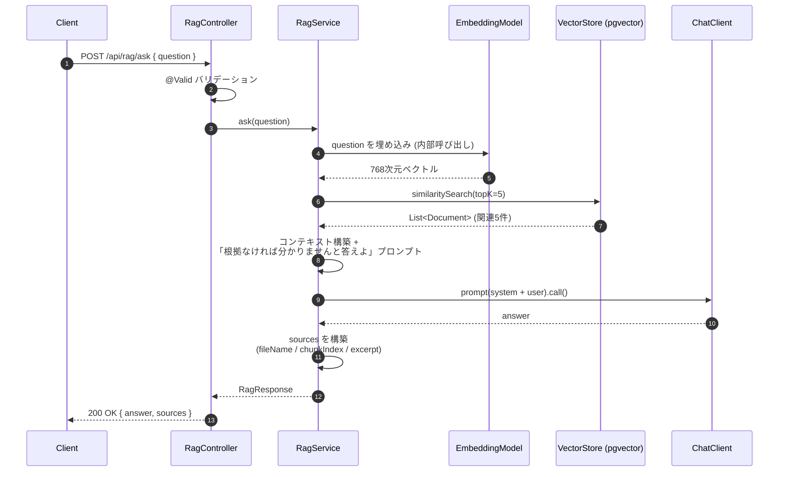
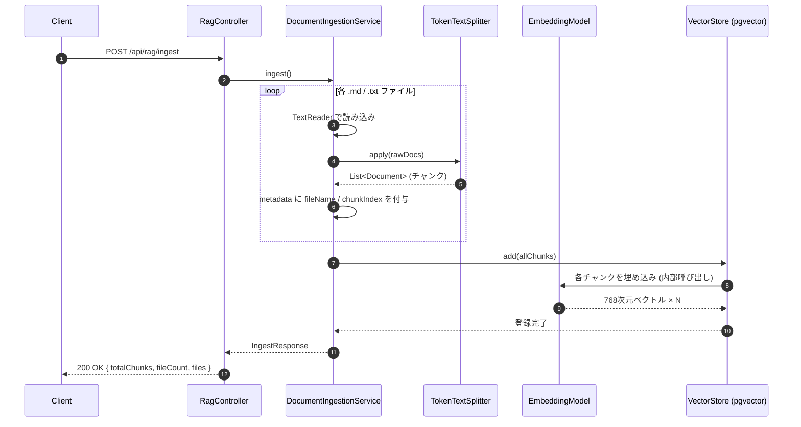

# spring-ai-multi-llm-demo

Java / Spring Boot / Spring AI を使って、業務システムに生成AI機能を組み込む検証プロジェクト。  
Ollama（ローカルLLM）と OpenAI を設定で切り替え可能。

## 目的

Javaバックエンドエンジニアとして、既存業務システムにLLM機能を安全に統合するための実装パターンを検証する。

## 技術スタック

- Java 21 (LTS)
- Spring Boot 3.5.x
- Spring AI 1.1.5
- Ollama（デフォルト）/ OpenAI API
- pgvector（RAGプロファイル）
- JUnit / Mockito

---

## 設計上の見どころ

- **既存 API を壊さない拡張** — `/api/chat` は `rag` プロファイル無効でそのまま動作。RAG 関連 Bean は `@Profile("rag")` でガードしており、DataSource が無い環境でも起動できる
- **プロファイル分離** — LLM プロバイダー (`ollama` / `openai`) と RAG (`rag`) を独立プロファイルにし、`ollama,rag` のように組み合わせる設計。LLM 切り替えとベクトル DB は直交する関心事
- **`EmbeddingModel` の排他選択** — Spring AI 1.1.5 の `spring.ai.model.embedding` プロパティを各プロファイルで設定し、Ollama / OpenAI の埋め込み Bean が同時生成されて `NoUniqueBeanDefinitionException` で起動失敗するのを回避
- **次元数を 768 で固定** — Ollama (`nomic-embed-text`) と OpenAI (`text-embedding-3-small`) を 768次元に揃え、プロファイル切替時にも pgvector のテーブルスキーマ不一致を起こさない
- **Single-query RAG 方式** — `QuestionAnswerAdvisor` を使わず手動で `similaritySearch` → プロンプト構築 → LLM 呼び出し。DB アクセスを 1 回に抑え、`sources` も同じ検索結果から組み立てる
- **責務の3層分離** — Controller / Service / DTO で責務を明確化。`RagService.ask()` も `searchSimilarDocuments` / `buildSystemPrompt` / `invokeLlm` / `toSourceDocument` の4ステップに分割し、テストも各観点で書ける
- **例外を意味別にマッピング** — AI プロバイダー固有例外 (`NonTransientAiException` → 502 / `TransientAiException` → 503) と内部例外 (`IllegalStateException` → 500) を `GlobalExceptionHandler` で分類

---

## RAGの処理フロー

### 質問応答 (`POST /api/rag/ask`)



### 文書投入 (`POST /api/rag/ingest`)



---

## 実務を想定した安全策

| 観点 | 対策 |
|---|---|
| 機密情報 | API キー・DB パスワードは環境変数 / Secrets Manager 注入を前提。デフォルト値は dev-only と明記 ([詳細](#機密情報の扱い)) |
| 既存機能の保護 | RAG 関連 Bean を `@Profile("rag")` でガード、`rag` 無効時は `/api/chat` のみで起動可能 |
| プロバイダー切替事故 | `spring.ai.model.embedding` で `EmbeddingModel` を排他選択し、Bean 重複起動を防止 |
| LLM の暴走抑制 | システムプロンプトで「コンテキスト外の根拠で回答しない」を強制、根拠なし時は「分かりません」 |
| 例外の階層化 | AI プロバイダー例外 → 502 / 503、内部例外 → 500 に分類して HTTP ステータスを意味づけ |
| バリデーション | `@NotBlank` + `MethodArgumentNotValidException` ハンドラ → 400 + 日本語エラーメッセージ |
| エンコーディング | `HttpMessageNotReadableException` → 400 で「UTF-8 で送れ」と明示 |
| テスト分離 | コンテキストロードテストは `spring.autoconfigure.exclude` で DataSource 依存を切り、Docker 無しの CI でも実行可能 |

---

## 今後の改善 (v2 候補)

| 項目 | 内容 |
|---|---|
| PDF 投入 | `PagePdfDocumentReader` を追加し、PDF 文書も対象に |
| 認証・認可 | Spring Security + JWT / OIDC で API 保護 |
| 管理画面 UI | 文書一覧・削除・再投入をブラウザから操作可能に |
| 会話履歴付き RAG | フォローアップ質問対応 (Query Rewriting / `QuestionAnswerAdvisor`) |
| ストリーミング RAG | `/api/rag/ask/stream` を Server-Sent Events で実装 |
| RAG 評価 | RAGAS / Spring AI Evaluator で回答品質を自動測定 |
| 観測性 | Micrometer + OpenTelemetry でレイテンシ・トークン消費・retrieval ヒット率を可視化 |
| キャッシング | 同一質問の回答を Redis にキャッシュし、LLM コストとレスポンス時間を削減 |
| デプロイ自動化 | Dockerfile + GitHub Actions + ECS / Cloud Run |

---

## プロファイル構成

`src/main/resources/application.yml` の `spring.profiles.active` で切り替える。

```yaml
spring:
  profiles:
    active: ollama   # LLMプロバイダーを指定
```

LLMプロバイダーと RAG（pgvector）は独立したプロファイルとして分離されており、組み合わせて有効化できる。

| プロファイル | 役割 | 必要なもの |
|---|---|---|
| `ollama`（デフォルト） | ローカルLLM | Ollama インストール済み |
| `openai` | OpenAI API | `OPENAI_API_KEY` 環境変数 |
| `rag` | pgvector 接続 | Docker + `docker compose up -d` |

**RAGを使う場合はLLMプロファイルと組み合わせる:**

```yaml
spring:
  profiles:
    active: ollama,rag   # または openai,rag
```

---

## 起動方法

### pgvector を起動する（RAG使用時のみ）

**1. Docker Desktop が起動していることを確認**

**2. pgvector コンテナを起動**

```powershell
docker compose up -d
```

**3. 起動確認**

```powershell
docker compose ps
# State が healthy になれば接続準備完了
```

接続先: `jdbc:postgresql://localhost:5432/ragdb` (user: `raguser` / pass: `ragpass`)

> ⚠️ **このユーザー名・パスワードはローカル開発専用**です。`application-rag.yml` / `docker-compose.yml` にデフォルト値としてコミットしているのは「ローカル起動の摩擦をなくす」ためで、本番環境では絶対にそのまま使わないでください。詳細は下の「[機密情報の扱い](#機密情報の扱い)」を参照。

接続先は環境変数で変更可能:

```powershell
$env:SPRING_DATASOURCE_URL = "jdbc:postgresql://other-host:5432/mydb"
$env:SPRING_DATASOURCE_USERNAME = "myuser"
$env:SPRING_DATASOURCE_PASSWORD = "mypassword"
```

**コンテナ停止 / データ削除**

```powershell
docker compose down          # コンテナ停止（データ保持）
docker compose down -v       # コンテナ停止 + ボリューム削除
```

---

### Ollama で起動する（デフォルト）

**1. Ollamaのインストール**

https://ollama.com/download からWindows版をインストール。  
インストール後、`http://localhost:11434` で自動起動する。

**2. モデルのダウンロード**

```powershell
ollama pull gemma4:e4b
```

**3. アプリ起動**

```powershell
./mvnw spring-boot:run
```

モデルやURLは環境変数で上書き可能：

```powershell
$env:OLLAMA_MODEL = "llama3.2"
$env:OLLAMA_BASE_URL = "http://192.168.1.10:11434"
./mvnw spring-boot:run
```

**RAG機能も有効にする場合（pgvector 起動済みが前提）:**

```powershell
./mvnw spring-boot:run "-Dspring-boot.run.profiles=ollama,rag"
```

---

### RAG を試す（Ollama プロファイル・検証済み手順）

以下を上から順に実行すれば `/api/rag/ask` までひと通り動く。

```powershell
# 1) Docker Desktop を起動（タスクトレイで Engine running を確認）

# 2) pgvector コンテナ起動
docker compose up -d
docker compose ps                  # State が healthy になるまで待つ

# 3) Ollama に LLM + 埋め込みモデルを取得（初回のみ）
ollama pull gemma4:e4b
ollama pull nomic-embed-text

# 4) アプリ起動（別ターミナル）
./mvnw spring-boot:run "-Dspring-boot.run.profiles=ollama,rag"

# 5) 文書投入（src/main/resources/docs/ の .md / .txt が pgvector に登録される）
Invoke-RestMethod -Uri "http://localhost:8080/api/rag/ingest" -Method POST
# => totalChunks / fileCount / files が返れば成功

# 6) RAG 質問
$body = [System.Text.Encoding]::UTF8.GetBytes('{"question": "Spring AIとは何ですか？"}')
Invoke-RestMethod -Uri "http://localhost:8080/api/rag/ask" `
  -Method POST -ContentType "application/json; charset=UTF-8" -Body $body
# => answer + sources (fileName / chunkIndex / excerpt) が返る
```

---

### OpenAI で起動する

**1. `application.yml` を編集**

```yaml
spring:
  profiles:
    active: openai
```

**2. APIキーを設定して起動**

```powershell
$env:OPENAI_API_KEY = "sk-..."
./mvnw spring-boot:run
```

モデルの変更：

```powershell
$env:OPENAI_MODEL = "gpt-4o-mini"
```

**RAG機能も有効にする場合（pgvector 起動済みが前提）:**

```powershell
$env:OPENAI_API_KEY = "sk-..."
./mvnw spring-boot:run "-Dspring-boot.run.profiles=openai,rag"
```

---

## API

### `POST /api/chat` — 通常レスポンス

全文生成完了後にJSONで返す。

**リクエスト**

```json
{ "question": "Spring AIとは何ですか？" }
```

**レスポンス (200 OK)**

```json
{
  "answer": "Spring AIは、Springエコシステム向けのAIフレームワークです...",
  "model": "gemma4:e4b"
}
```

**PowerShell での確認例**

```powershell
$body = [System.Text.Encoding]::UTF8.GetBytes('{"question": "Spring AIとは何ですか？"}')
$res = Invoke-RestMethod -Uri "http://localhost:8080/api/chat" -Method POST -ContentType "application/json; charset=UTF-8" -Body $body
$res.answer
```

---

### `POST /api/chat/stream` — ストリーミングレスポンス（SSE）

トークン生成のたびに即座にテキストが流れる。体感速度が大幅に向上する。

**PowerShell / curl での確認例**

```powershell
# UTF-8ファイル経由でcurl.exeに渡す
$body = '{"question": "Spring AIとは何ですか？"}'
[System.IO.File]::WriteAllText("$env:TEMP\req.json", $body, [System.Text.Encoding]::UTF8)

curl.exe -N -X POST http://localhost:8080/api/chat/stream `
  -H "Content-Type: application/json; charset=UTF-8" `
  --data-binary "@$env:TEMP\req.json"
```

```bash
# Git Bash
curl -N -s -X POST http://localhost:8080/api/chat/stream \
  -H "Content-Type: application/json" \
  -d '{"question": "What is Spring AI?"}'
```

---

### `POST /api/rag/ask` — RAG質問応答（`rag` プロファイル有効時のみ）

VectorStore から類似文書を topK=5 で検索し、その内容のみをコンテキストとして LLM に回答させる。
コンテキストに根拠がない場合は LLM が「分かりません」と返すようプロンプトで制御している。

**前提**: pgvector 起動済み + `POST /api/rag/ingest` で文書投入済み + LLMプロバイダー（Ollama / OpenAI）が起動済み。

**リクエスト**

```json
{ "question": "Spring AIとは何ですか？" }
```

**レスポンス (200 OK)**

```json
{
  "answer": "Spring AIはJavaエコシステム向けのAIフレームワークです。OpenAIやOllamaなどのLLMプロバイダーに統一インターフェースを提供します。",
  "sources": [
    {
      "fileName": "spring-ai-overview.md",
      "chunkIndex": 0,
      "excerpt": "Spring AI は Java エコシステム向けの AI フレームワークです。OpenAI / Ollama / Anthropic など複数の LLM プロバイダーに対して統一されたインターフェースを提供..."
    }
  ]
}
```

**PowerShell での確認例**

```powershell
$body = [System.Text.Encoding]::UTF8.GetBytes('{"question": "Spring AIとは何ですか？"}')
$res = Invoke-RestMethod -Uri "http://localhost:8080/api/rag/ask" `
  -Method POST -ContentType "application/json; charset=UTF-8" -Body $body
$res.answer
$res.sources | Format-Table fileName, chunkIndex, excerpt
```

**curl (Git Bash) での確認例**

```bash
curl -s -X POST http://localhost:8080/api/rag/ask \
  -H "Content-Type: application/json; charset=UTF-8" \
  -d '{"question": "What is Spring AI?"}' | jq
```

---

### `POST /api/rag/ingest` — 文書投入（`rag` プロファイル有効時のみ）

`src/main/resources/docs/` 配下の `.md` / `.txt` を読み込み、チャンク分割して pgvector に登録する。
各チャンクには `fileName` / `chunkIndex` メタデータが付与され、`/api/rag/ask` のレスポンスで参照される。

**事前準備（Ollama 利用時）**: 埋め込みモデルを取得する。

```powershell
ollama pull nomic-embed-text
```

**リクエスト**: ボディ不要

**レスポンス (200 OK)**

```json
{
  "totalChunks": 12,
  "fileCount": 2,
  "files": ["project-overview.txt", "spring-ai-overview.md"]
}
```

**PowerShell での確認例**

```powershell
Invoke-RestMethod -Uri "http://localhost:8080/api/rag/ingest" -Method POST
```

---

### エラーレスポンス

**バリデーションエラー (400)**

```json
{ "message": "question: 質問は必須です", "status": 400 }
```

**エンコードエラー (400)** — UTF-8以外のリクエスト送信時

```json
{ "message": "リクエストの解析に失敗しました。Content-Type: application/json; charset=UTF-8 でリクエストを送信してください。", "status": 400 }
```

**サーバーエラー (500)**

```json
{ "message": "サーバーエラーが発生しました: ...", "status": 500 }
```

**AIプロバイダーエラー (502)** — LLM/埋め込みモデル未取得・APIキー無効など

```json
{ "message": "AIプロバイダーへのリクエストが失敗しました: ...", "status": 502 }
```

**AIプロバイダー一時エラー (503)** — レート制限・タイムアウトなど

```json
{ "message": "AIプロバイダーが一時的に利用できません。時間をおいて再試行してください: ...", "status": 503 }
```

---

## 機密情報の扱い

このリポジトリには **ローカル開発を即起動できる** ためのデフォルト値が含まれている。**本番環境ではどれもそのまま使ってはならない**。

| 項目 | 現在の扱い | 本番で必要な対応 |
|---|---|---|
| OpenAI API キー | `application-openai.yml` で `${OPENAI_API_KEY}` のみ参照。リポジトリにキーは含めない | 環境変数 / Secrets Manager (AWS Secrets Manager / Azure Key Vault / HashiCorp Vault) から注入 |
| pgvector DB パスワード | `application-rag.yml` / `docker-compose.yml` にローカル開発用デフォルト `ragpass` をコミット | 必ず `SPRING_DATASOURCE_PASSWORD` を環境変数 or Secrets Manager から注入。デフォルト値をそのまま使わない |
| pgvector DB ユーザー名 | デフォルト `raguser` をコミット | 同上 (`SPRING_DATASOURCE_USERNAME`) |
| OPENAI_MODEL / OLLAMA_MODEL | デフォルトモデル名をコミット | 機密ではないので環境変数による上書きでOK |

**設計上の考え方:**

- **デフォルト値をリポジトリに置いている理由** — 新規参加者が `git clone` 後すぐに `docker compose up -d` だけで起動できるようにする摩擦削減のため。値そのものは公開を前提とした「ローカル専用クレデンシャル」。
- **本番でやってはいけないこと** — `application-*.yml` に本番のDBパスワード / APIキー / 接続先を書き込むこと。Git の履歴から漏洩する。
- **本番でやるべきこと** — 環境変数 (`SPRING_DATASOURCE_PASSWORD`, `OPENAI_API_KEY` 等) を CI/CD パイプラインや実行環境のシークレットマネージャから注入し、YAML の `${...:default}` パターンの **デフォルト部分は本番では参照されない** ようにする。
- **`.gitignore`** — `.env` や `application-local.yml` を追加し、開発者が個人クレデンシャルを誤ってコミットしないようにすることを推奨。

---

## テスト

```powershell
./mvnw test
```

| テストクラス | 種別 | 内容 |
|---|---|---|
| `ChatControllerTest` | `@WebMvcTest` | バリデーション・正常系・異常系のHTTPレイヤーテスト |
| `ChatServiceTest` | Mockito 単体 | ChatClientのモックによるサービスロジック検証 |
| `DocumentIngestionServiceTest` | Mockito 単体 | 文書読み込み・チャンク分割・メタデータ付与の検証 |
| `RagServiceTest` | Mockito 単体 | 類似検索結果からのプロンプト構築・sources 生成の検証 |
| `SpringAiDemoApplicationTests` | `@SpringBootTest` | アプリケーションコンテキストの起動確認 |

---

## プロジェクト構成

```
spring-ai-multi-llm-demo/
├── docker-compose.yml                      # pgvector コンテナ定義
└── src/main/
    ├── java/com/example/demo/
    │   ├── SpringAiDemoApplication.java
    │   ├── config/
    │   │   ├── ChatConfig.java             # プロファイル別 ChatClient Bean定義
    │   │   └── RagConfig.java              # TokenTextSplitter / 文書リソース Bean (ragプロファイル)
    │   ├── controller/
    │   │   ├── ChatController.java         # POST /api/chat, POST /api/chat/stream
    │   │   └── RagController.java          # POST /api/rag/ingest, POST /api/rag/ask (ragプロファイル)
    │   ├── service/
    │   │   ├── ChatService.java            # Spring AI 呼び出し（通常・ストリーミング）
    │   │   ├── DocumentIngestionService.java # 文書読み込み + pgvector 登録 (ragプロファイル)
    │   │   └── RagService.java             # 類似検索 + LLM 回答生成 (ragプロファイル)
    │   ├── dto/
    │   │   ├── ChatRequest.java
    │   │   ├── ChatResponse.java
    │   │   ├── ErrorResponse.java
    │   │   ├── IngestResponse.java
    │   │   ├── RagRequest.java
    │   │   ├── RagResponse.java
    │   │   └── SourceDocument.java
    │   └── exception/
    │       └── GlobalExceptionHandler.java # エラーの統一ハンドリング
    └── resources/
        ├── application.yml                 # 共通設定・プロファイル指定
        ├── application-ollama.yml          # Ollama設定（デフォルト）
        ├── application-openai.yml          # OpenAI設定
        ├── application-rag.yml             # pgvector DataSource 設定（ragプロファイル）
        └── docs/                           # RAG 投入対象の文書 (.md / .txt)
```
